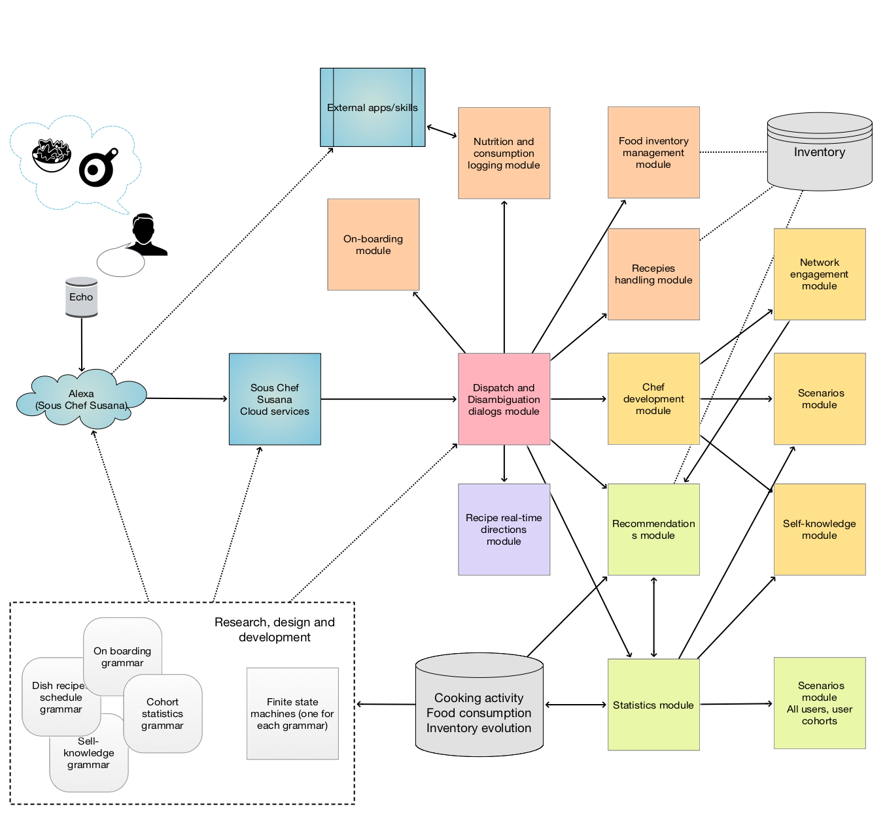

# Sous Chef Susana

## What is this about

This repository has the organizational files and design documents and diagrams for 
the conversational agent Sous Chef Susana.

Sous Chef Susana can help with food preparation and cooking decision-making. 
Its features include personalization, recommendations, (real-time) cooking instructions and cooking tracking.

The organizational documents are used to enumerate and prioritize 
the research, design, and implementation of Sous Chef Susana's (sub-)modules.

-----

## Motivation

Food is essential to life, but cooking your own food is optional. 
During the long years of being a student, 
I've had the excuse of prioritizing my hectic education life above other necessities at times, such as cooking. 
I always knew that cooking my own food would not be just healthier, but also economical -- 
yet I've failed to turn cooking into a habit. 
Waiting to gain the habit in my adult years, I was surprised to find out that life always put obstacles to that at any stage. 
As an adult female taking part in the working life, 
I often find myself dealing with the challenging question of "what do I cook today?" 
and not always asked by me but also by my spouse. 
While admiring my own mother's years of hard-working and dedication to feed her family without any excuse, 
I would like to make life easier using technology for people who're not yet natural chef's (like me) 
yet want to achieve the best of themselves.

Motivated by these, we present Sous Chef Susana, that is a conversational agent 
designed to foster cooking decision-making, 
with the features including personalization, recommendations, (real-time) cooking instructions and cooking tracking.

There exists an excessive amount of cooking-related applications and social media content, and 
yet they seem to fail at addressing the real questions. 
One can be overwhelmed, for instance, in the lake of countless recipes and instructions and 
with ingredients that are hard to retrieve. Furthermore, gaining, improving and maintaining the habit of 
cooking and creating cooking plans (or just being a successful causal chef) 
is a personal process that implies that learnings should be collected and utilized. 
Existing solutions do not aim at creating personalized cooking plans built upon various stages of preparation, 
including introspective look over cooking history and personal preferences.

------

## Design diagram

[](./Diagrams/Sous-Chef-Susana-design.pdf)

------

## Example commands / dialogs

```
What dishes can I cook within two hours?
Which one has the simplest recipe?
```

```
Suggest six Mediterranean dishes for the next ten days.
Use ingredients budget within $90.
```

```
What people like me ate in the last month?
What is the ingredients breakdown?
```

```
Instruct me to cook moussaka.
```

-----


